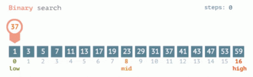
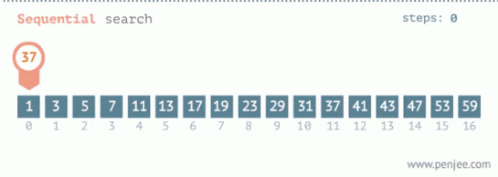

# Programming of Data Structures and Fundamental Algorithms

## Table of contents:

- [Time Complexity](#com)
- [Search Algorithms](#s-a)

<a id="com"></a>

### Time Complexity

`Big O notation` - _How code slows as data grows_


> **O(1) = constant time**
>
> - Random access of an element in an array
> - Inserting at the beginning of linkedlist

> **O(log n) = logarithmic time**
>
> - Binary search

> **O(n) = linear time**
>
> - Looping through elements in an array
> - Searching through a linkedlist

> **O(n log n) = quasilinear time**
>
> - Quicksort
> - Mergesort
> - Heapsort

> **O(n^2) = quadratic time**
>
> - Insertion sort
> - Selection sort
> - Bubblesort

<a id="s-a"></a>

### Search Algorithms

<blockquote>

<b>Binary Search</b>



```js
BinarySearch(arr, target):
    left = 0
    right = length(arr) - 1

    while left <= right:
        mid = (left + right) // 2  // Calculate the middle index

        if arr[mid] == target:
            return mid  // Found the target, return its index
        elif arr[mid] < target:
            left = mid + 1  // Target is in the right half
        else:
            right = mid - 1  // Target is in the left half

    return -1  // Target not found in the array
```

</blockquote>

<blockquote>

<b>Sequential Search</b>



```js
SequentialSearch(arr, target):
    for i from 0 to length(arr) - 1:
        if arr[i] == target:
            return i  // Found the target, return its index

    return -1  // Target not found in the array
```

</blockquote>
